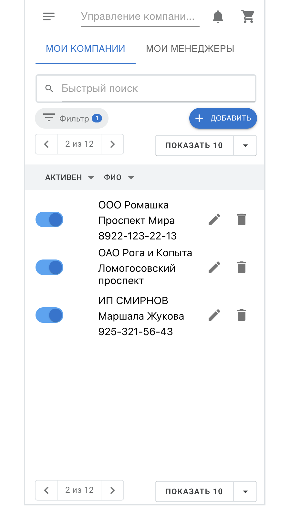
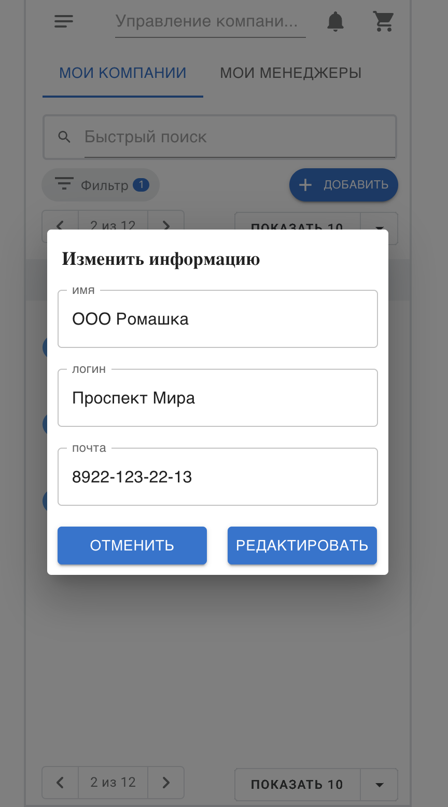

# ManagerCompanyReact

 
Для запуска в браузере необходимо:

Открыть терминал

Необходимо скачать зависимости командой
- npm install
Запустить командой 
- npm start
На сайте можно выбрать "Мои Компании" или  "Мои Менеджеры"
 

 
Далее мы можем создать нового Менеджера, можем редактировать информацию, либо полность удалить выбранного менеджера. А так же можем выбрать режим "активен". Все тоже самое возможно сделать во вкладке "Мои Компании" 

